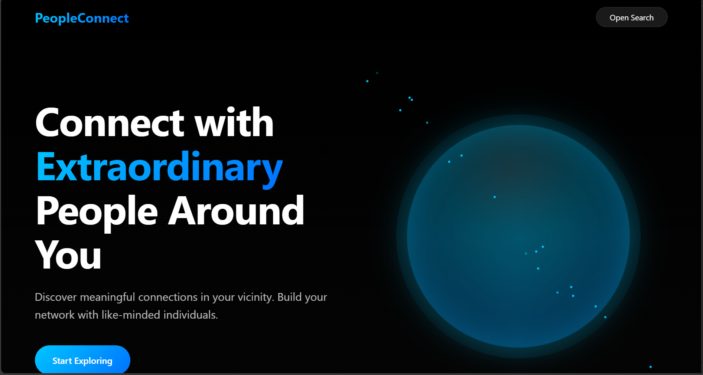
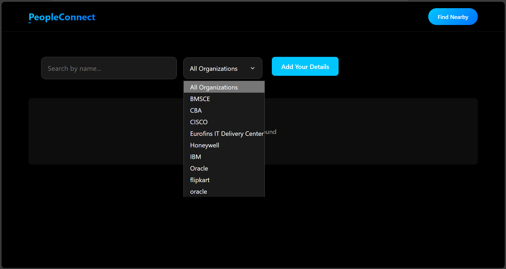
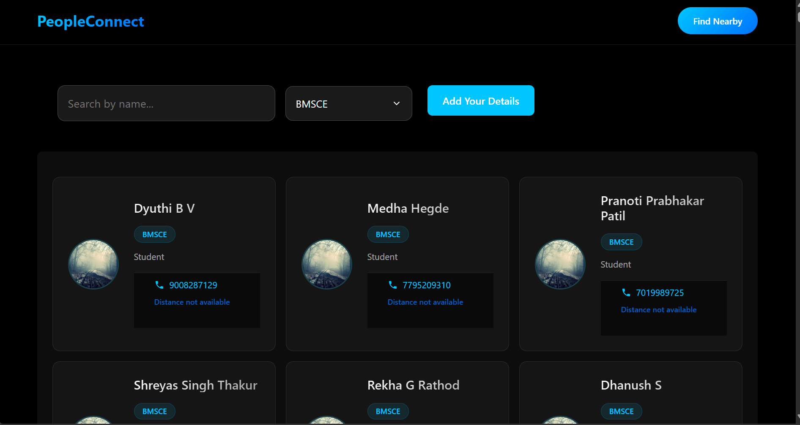
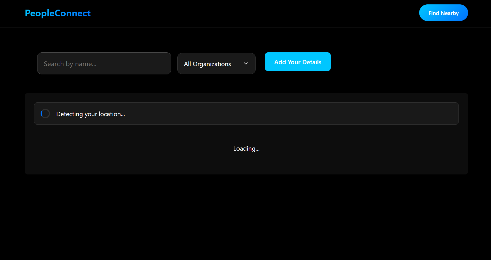
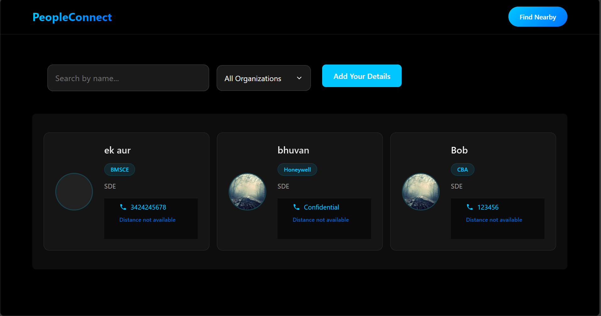
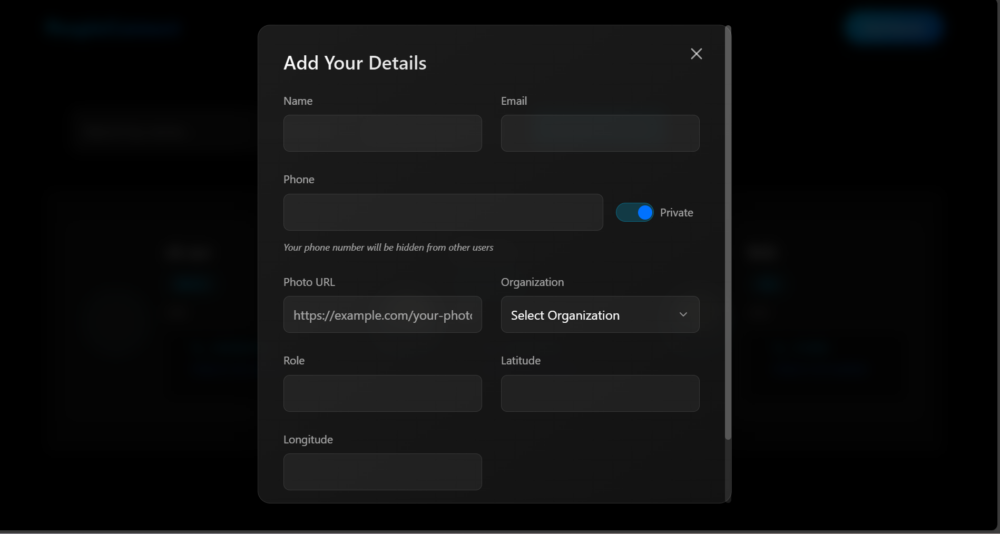
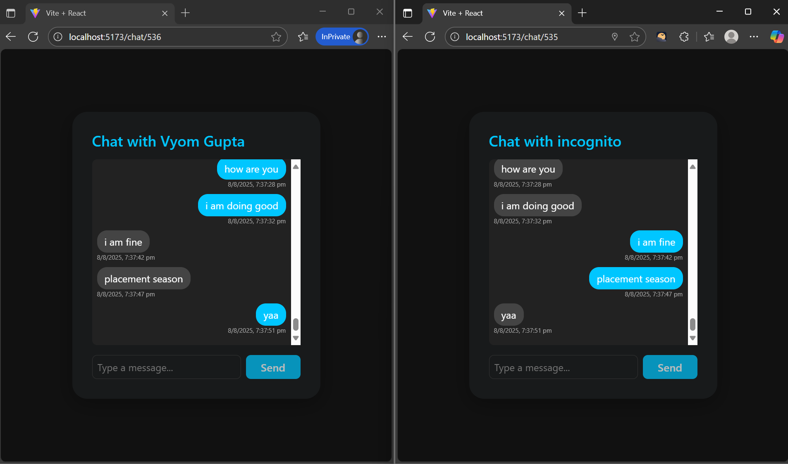

# People Search Website with Google Sheets Integration

This project is a full-stack application that lets you search a people database stored in Google Sheets and visualize their location on a map.

## Features

* Search people by name (case-insensitive)
* View photo, phone number, email
* Interactive map (Leaflet + OpenStreetMap) with markers
* "Nearby" API that can return people within a given radius
* Real-time data sync with Google Sheets
* Minimal classy dark (black & white) theme using Material-UI

## Google Sheets Setup

1. Create a new Google Sheet with the following structure:

   | ID | Name | Photo URL | Phone | Email | Latitude | Longitude |
   |----|------|-----------|--------|--------|----------|------------|
   | 1  | Alice Johnson | https://... | +1 202... | alice@... | 38.897957 | -77.03656 |

2. Share the sheet with appropriate permissions
3. Get the Spreadsheet ID from the URL (it's the long string in the middle of the URL)
4. Set up Google Sheets API:
   - Go to [Google Cloud Console](https://console.cloud.google.com)
   - Create a new project
   - Enable Google Sheets API
   - Create credentials (Service Account recommended)
   - Download the credentials as `service_account.json`

## Tech stack

* Python 3.10+
* Flask + Google Sheets API
* React + Material-UI
* Leaflet.js for maps

## Setup

1. Create a virtual environment (optional but recommended):

```bash
python -m venv venv
source venv/bin/activate  # macOS/Linux
venv\Scripts\activate    # Windows
```

2. Install dependencies:

```bash
pip install -r requirements.txt
cd frontend && npm install
```

3. Set up authentication:
   - Place your `service_account.json` in the project root
   - Update `SPREADSHEET_ID` in `app.py` with your Google Sheet ID

4. Run the servers:

Backend:
```bash
python app.py
```

Frontend:
```bash
cd frontend && npm run dev
```

5. Open your browser and navigate to `http://localhost:5173`.

## Customizing the Data

1. Open your Google Sheet
2. Add/edit/remove rows as needed
3. The changes will be reflected in real-time when users search
4. Make sure to maintain the column structure:
   - ID (unique identifier)
   - Name
   - Photo URL
   - Phone
   - Email
   - Latitude (decimal degrees)
   - Longitude (decimal degrees)

## Sample Data Format

Here's a sample row for reference:
```
ID: 1
Name: Alice Johnson
Photo URL: https://randomuser.me/api/portraits/women/44.jpg
Phone: +1 202-555-0153
Email: alice.johnson@example.com
Latitude: 38.897957
Longitude: -77.03656
```

## Deployment

Because this is a standard Flask + React app, you can deploy it on any platform supporting Python and Node.js (Fly.io, Render, Heroku, etc.) or containerize it with Docker. 

## Screenshots

### Homepage

### Search

### Search Results 

### Finding Nearby People

### People Nearby Results

### Add Details

### Real Time Chatting happening between two users => Both users on different windows of browser
